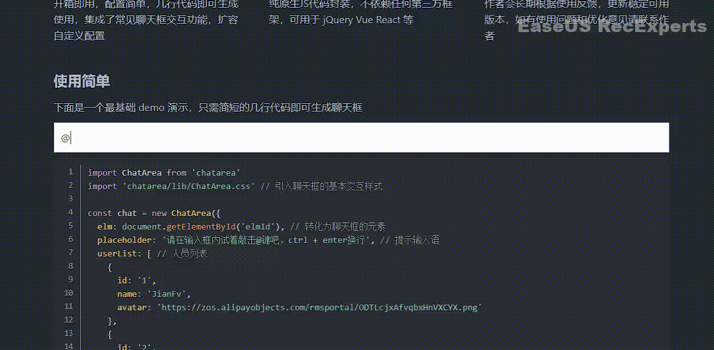
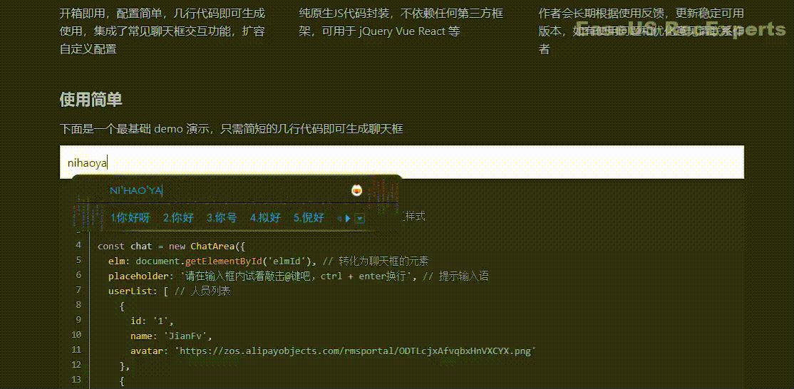
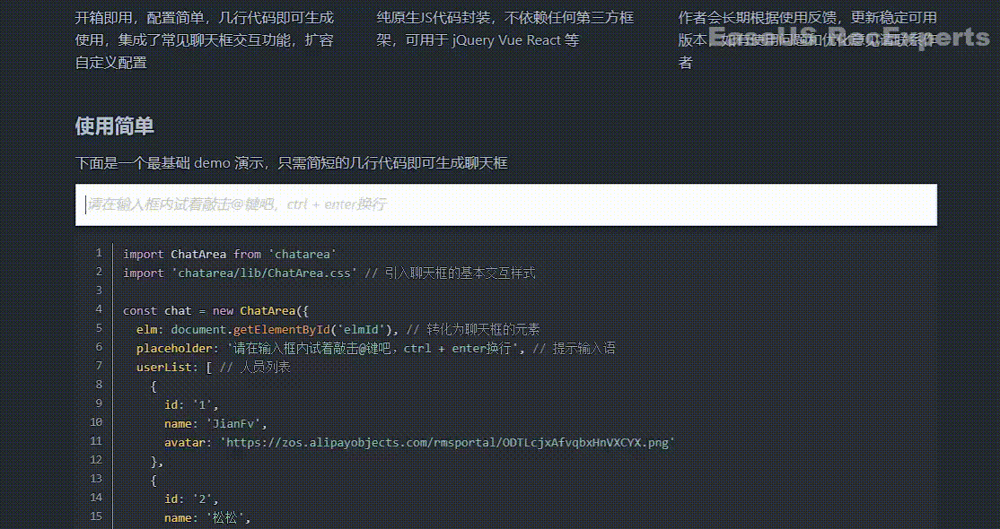
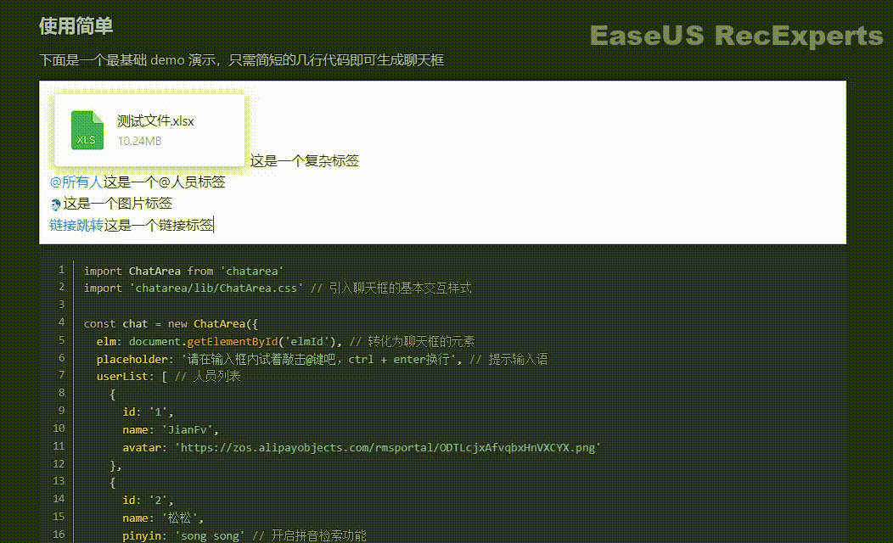
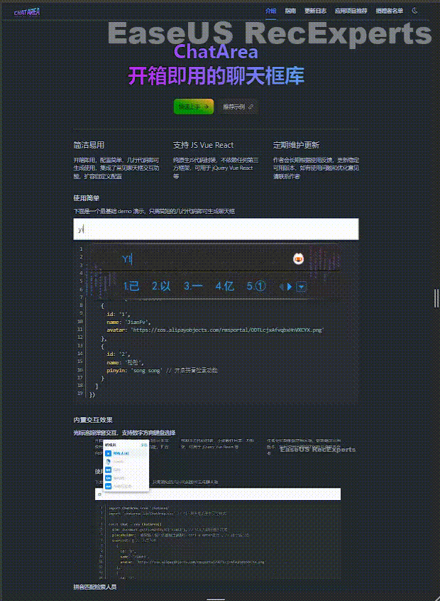

<div align="center">
    
    <h4>纯js封装的聊天框，兼容各大框架适用，适配pc与h5的交互</h4>
</div>


#### 支持@人员选择

#### 拼音匹配

#### 人员多选

#### 混合粘贴

#### 支持移动端使用

<h3>
  <a href="https://www.jianfv.top/ChatAreaDoc/" target="_blank">更多特性支持 请点击 => 访问官网文档</a>
</h3>

#### 项目结构
```angular2html
|-- chat-area
    |
    |-- es5 // 低版本浏览器兼容
    |   |-- ChatArea.css
    |   |-- ChatArea.js
    |   |-- System.js
    |
    |-- lib
    |    |-- ChatArea.css
    |    |-- ChatArea.js
    |
    |-- demo.html // 示例页
    |-- es5.html // ES5示例引用方法
```

### 安装
```
npm i --save chatarea
```
### 基本使用
```javascript
import ChatArea from 'chatarea'
// 引入css样式
import 'chatarea/lib/ChatArea.css'

// 此时页面将你传入的元素生成为一个简单的聊天框,你可以通过元素class修改为你提供的默认样式
const chat = new ChatArea({
  elm: document.getElementById('id'), // 从dom上抓取一个元素将其改造为聊天框
  userList: [ // 当输入@键时弹出人员选择的列表
    { id: '1', name: '张三', avatar: 'https://zos.alipayobjects.com/rmsportal/ODTLcjxAfvqbxHnVXCYX.png', pinyin: 'song song' },
    { id: '2', name: '李四' },
    { id: '3', name: 'jianfv' }
  ],
  placeholder: '请输入文本框内容', // 输入提示文案
  maxLength: 2000, // 设置聊天框最大文本输入长度 默认没有限制（*如果业务场景没声明需要限制 就不要配置该值减少不必要的开销）
  asyncMatch: false, // 人员列表是否开启异步加载模式
  // 其余扩展配置项
  customTrigger: [ // 自定义弹窗触发符
    {
      dialogTitle: '群话题',
      prefix: '#',
      tagList: [
        { id: 'ht1', name: '话题一', pinyin: 'hua ti yi' },
        { id: 'ht2', name: '话题二', pinyin: 'hua ti er' }
      ]
    }
  ],
  selectList: [ // 定义选择元素
    {
      dialogTitle: '比例',
      key: 'ratio',
      options: [
        { id: '1', name: '4:3', preview: 'preview url' },
        { id: '2', name: '16:9', preview: 'preview url' },
      ]
    }
  ],
  copyType: ['text', 'image'], // 允许在输入框内粘贴板粘贴的类型 默认值：['text']
  userProps: { // 转义userList中id,avatar,pinyin的属性名与实际业务数据属性名
    id: 'id',
    name: 'name',
    avatar: 'avatar',
    pinyin: 'pinyin'
  },
  needDialog: true, // 是否需要默认的交互弹窗，可以自定义支持
  needCallEvery: true, // 是否需要@全部选项
  needCallSpace: false, // 是否需要像微信一样在 @标签 后面衔接一个空格之间的距离
  needDebounce: true, // 是否对交互点启用防抖函数
  wrapKeyFun: (event) => event.ctrlKey && ['Enter'].includes(event.key), // 自定义折行键
  sendKeyFun: (event) => !event.ctrlKey && ['Enter'].includes(event.key) // 自定义发送键
})
```

### API
```javascript
// 修改实例对象的配置项， 配置属性非必传 按需传入修改
chat.updateConfig({
  userProps: { id: 'userId', name: 'userName' },
  userList: [{ userId: 'NEW1', userName: '新的人员' }],
  customTrigger: [{ dialogTitle: '群话题', prefix: '#', tagList: [] }],
  selectList: [{ dialogTitle: '比例', key: 'ratio', options: [] }],
  needCallEvery: false,
  placeholder: '新的提示语',
  maxLength: 3000,
  // ...其余配置
})

// 获取聊天框精简后的文本内容
chat.getText()

// 获取聊天框精简后的html内容
chat.getHtml()

// 获取聊天框内容里 配置项userList 所包含@人员标签的人员信息
chat.getCallUserList()

// 获取聊天框内容里所有@人员标签的人员信息
chat.getCallUserTagList()

// 获取自定义触发符弹窗已选择的数据列表
chat.getCustomTagList()

// 获取标签选择元素已选择的数据列表
chat.getSelectTagList()

// 将getHtml生成的html片段进行逆向解析回填至聊天框，常用于消息撤回重新编辑功能
chat.reverseAnalysis('getHtml return value', true) // 第二配置项参数可以控制是否保留当前聊天框内容进行拼接回填内容

// 往聊天框光标处插入html内容
chat.insertHtml(``) // 光标处插入图片，可以使用该方法插入表情包

// 往聊天框光标处插入文本内容
chat.insertText('txt')

// 往聊天框光标处插入@人员标签元素
chat.setUserTag({ id: '1', name: '松松' })

// 往聊天框光标处插入自定义标签元素
chat.setCustomTag({ id: 'ht1', name: '话题1' }, '#')

// 往聊天框光标处插入选择标签元素
chat.setSelectTag({ id: '1', name: '4:3' }, 'ratio')

// 删除聊天框内指定的的@标签元素
chat.delUserTags(['1'])

// 删除聊天框内指定的的自定义标签元素
chat.delCustomTags('#', ['ht1'])

// 删除聊天框内指定的选择标签元素
chat.delSelectTags('ratio', ['1'])

// 清空输入框方法
chat.clear()

// 获取聊天框内容是否为空
chat.isEmpty()

// 用于页面或组件销毁时卸载在body内挂载的元素
chat.dispose()

// 禁止聊天框编辑
chat.disabled()

// 允许聊天框编辑并将光标定向到聊天内容末尾
chat.enable()

// 添加事件订阅
chat.addEventListener('operate', () => {})

// 卸载事件订阅
chat.removeEventListener('operate', () => {})

// PC唤起人员光标选择弹窗
chat.showPCPointDialog()

// PC唤起人员多选选择弹窗
chat.showPCCheckDialog()

// 唤起PC自定义触发符选择弹窗
chat.showPCCustomTagDialog('#')

// H5唤起人员多选选择弹窗
chat.showH5Dialog()

// 撤销上一次聊天框操作
chat.undo()

// 恢复上一次撤销操作
chat.redo()

// 修改PC光标选择弹窗默认文案
chat.revisePCPointDialogLabel({
  title: '群成员',
  callEveryLabel: '所有人',
  checkLabel: '多选',
  emptyLabel: '暂无数据'
})

// 修改PC多选选择弹窗默认文案
chat.revisePCCheckDialogLabel({
  title: '选择要@的人',
  searchPlaceholder: '搜素人员名称',
  searchEmptyLabel: '没有匹配到任何结果',
  userTagTitle: '研讨成员列表',
  checkAllLabel: '全选',
  checkEmptyLabel: '请选择需要@的成员',
  confirmLabel: '确定',
  cancelLabel: '取消'
})

// 修改H5选择弹窗默认文案
chat.reviseH5DialogLabel({
  title: '选择提醒的人',
  callEveryLabel: '所有人',
  searchPlaceholder: '搜素人员名称',
  searchEmptyLabel: '没有匹配到任何结果',
  confirmLabel: '确定',
  cancelLabel: '收起'
})
// 关闭ChatArea 内置操作
chat.addEventListener('defaultAction', (type) => {
  switch (type) {
    case 'COPY': // 复制
      return 'PREVENT'
    case 'CUT': // 剪切
      return 'PREVENT'
    case 'PASTE': // 粘贴
      return 'PREVENT'
    case 'UNDO': // 撤销
      return 'PREVENT'
    case 'REDO': // 恢复
      return 'PREVENT'
  }
})
```